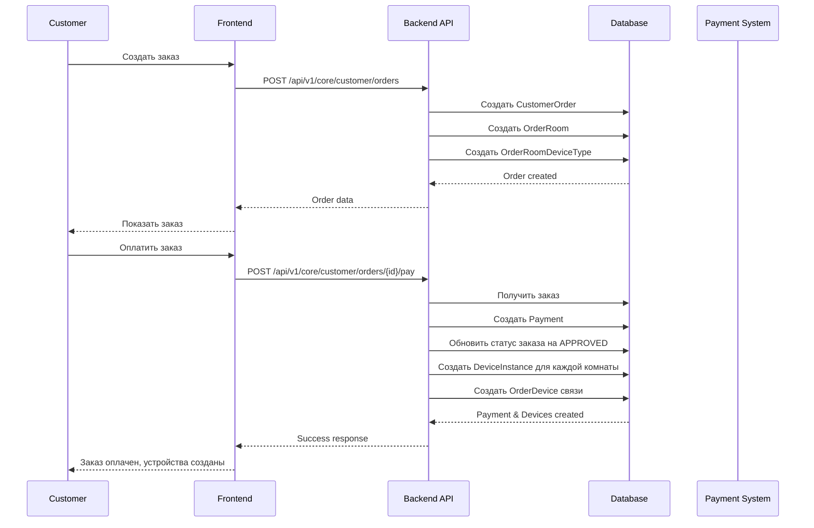
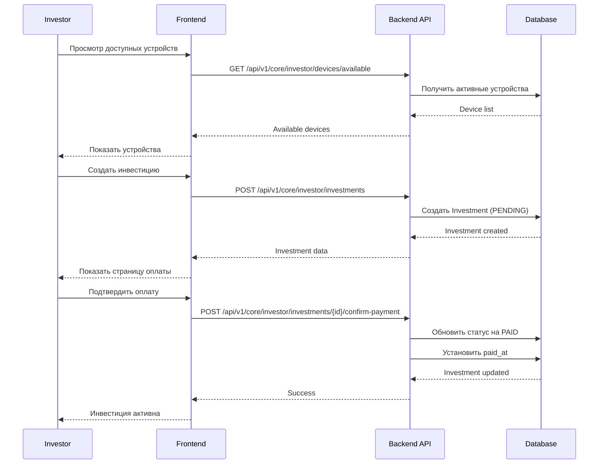
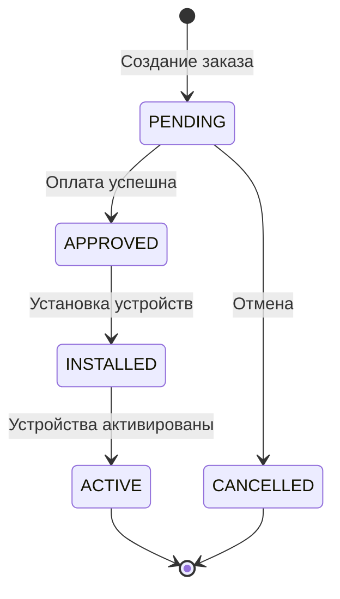
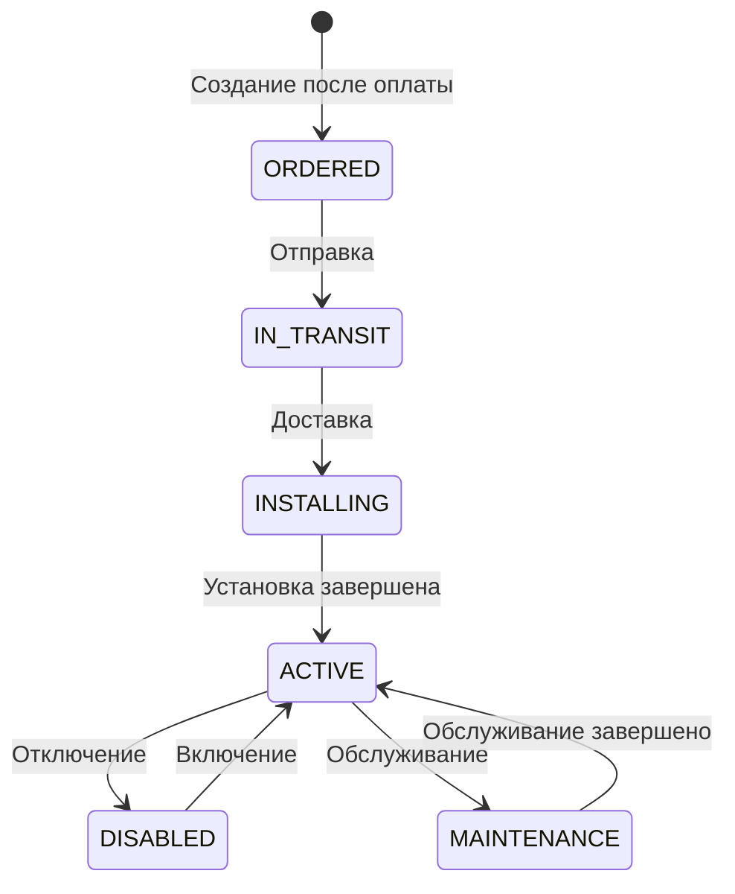
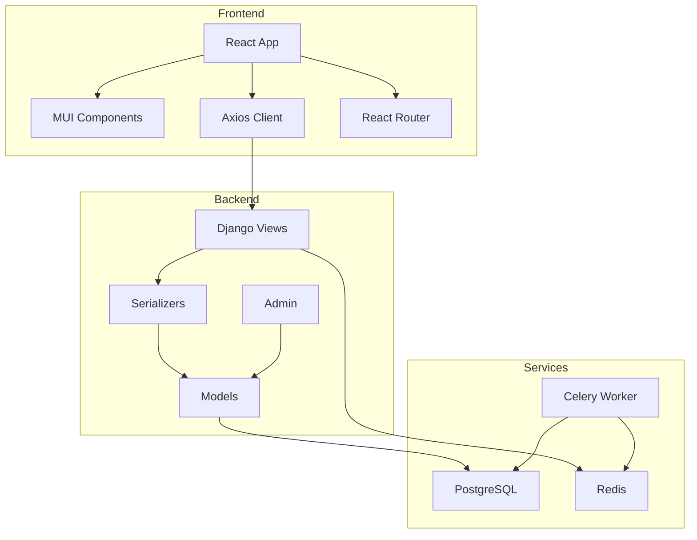
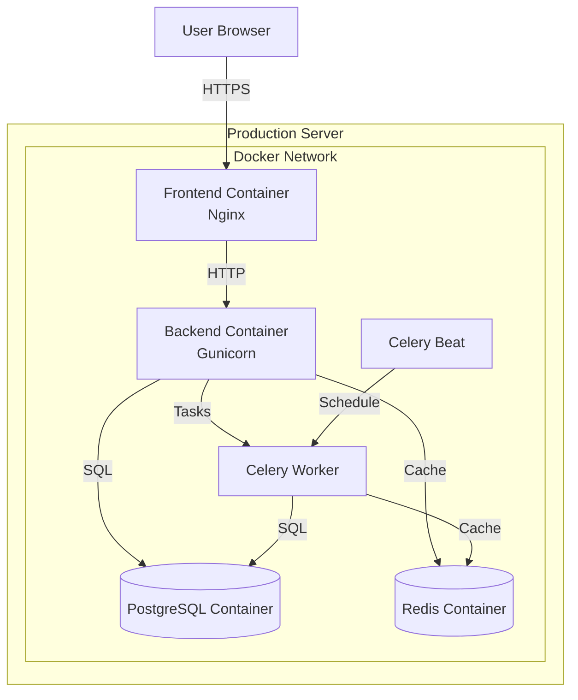
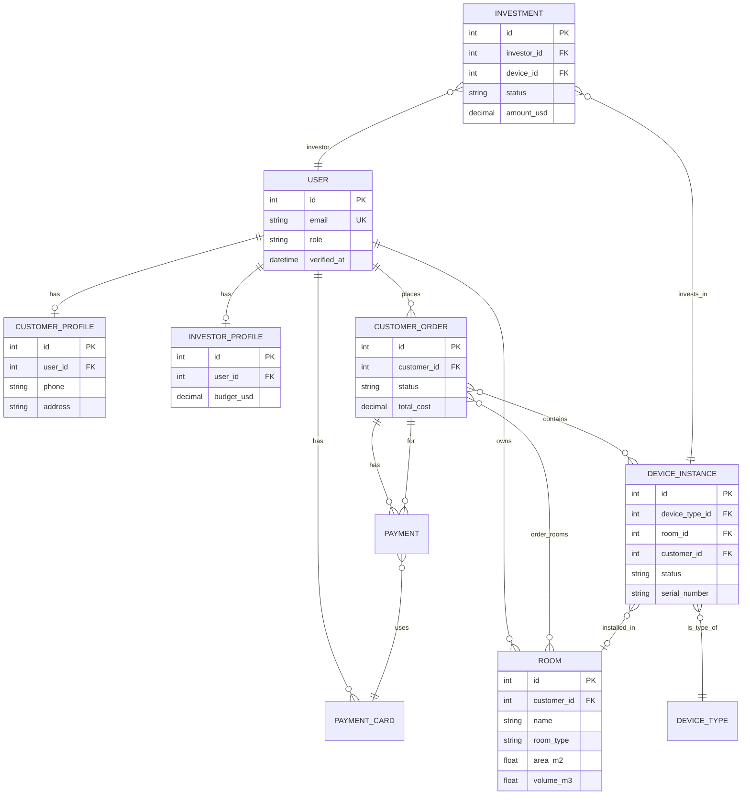

# UML Диаграммы

## Диаграмма классов - Основные модели

```mermaid
classDiagram
    class User {
        +String email
        +String role (CUSTOMER/INVESTOR)
        +DateTime verified_at
        +ForeignKey company
    }
    
    class CustomerProfile {
        +OneToOneField user
        +String phone
        +String address
    }
    
    class InvestorProfile {
        +OneToOneField user
        +String phone
        +Decimal budget_usd
    }
    
    class Room {
        +ForeignKey customer
        +String name
        +String room_type
        +Float area_m2
        +Float ceiling_height_m
        +Float volume_m3
    }
    
    class DeviceType {
        +String name
        +String device_category
        +Float coverage_area_m2
        +Boolean supports_cleaning
        +Boolean supports_humidifying
        +Boolean supports_aroma
        +Decimal min_investment_usd
        +Decimal max_investment_usd
        +Float investment_profit_percentage
    }
    
    class DeviceInstance {
        +ForeignKey device_type
        +ForeignKey room
        +ForeignKey customer
        +String status
        +String serial_number
        +Boolean is_power_on
    }
    
    class CustomerOrder {
        +ForeignKey customer
        +String status
        +Decimal total_cost
        +calculate_total_cost()
    }
    
    class Payment {
        +ForeignKey order
        +ForeignKey payment_card
        +String status
        +Decimal amount
        +DateTime paid_at
    }
    
    class Investment {
        +ForeignKey investor
        +ForeignKey device
        +String status
        +Decimal amount_usd
        +DateTime paid_at
    }
    
    class PaymentCard {
        +ForeignKey customer
        +String card_number_last4
        +String brand
        +Boolean is_default
    }
    
    User ||--o| CustomerProfile : has
    User ||--o| InvestorProfile : has
    User ||--o{ Room : owns
    User ||--o{ CustomerOrder : places
    User ||--o{ PaymentCard : has
    
    CustomerOrder ||--o{ Payment : has
    CustomerOrder }o--o{ DeviceInstance : contains
    CustomerOrder }o--o{ Room : contains
    
    DeviceInstance }o--|| DeviceType : is_type_of
    DeviceInstance }o--o| Room : installed_in
    
    Investment }o--|| DeviceInstance : invests_in
    Investment }o--|| User : investor
```

## Диаграмма последовательности - Создание заказа



## Диаграмма последовательности - Инвестиция



## Диаграмма состояний - Заказ клиента



## Диаграмма состояний - Устройство



## Диаграмма компонентов



## Диаграмма развертывания



## ER-диаграмма базы данных (основные таблицы)



## Примечания

Для визуализации этих диаграмм используйте:
- [Mermaid Live Editor](https://mermaid.live/)
- VS Code расширение "Markdown Preview Mermaid Support"
- GitHub/GitLab автоматически рендерят Mermaid диаграммы

